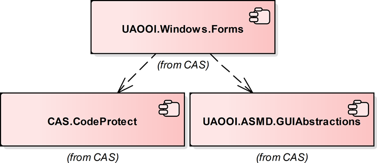

# Windows Forms Controls Library

The library contains `System.Windows.Forms` level programming support for [Object-Oriented Internet](https://github.com/mpostol/ProcessObserver) implementation.

The library was ported from the [CommServer](http://www.commsvr.com/) software family developed by [www.cas.eu](http://www.commsvr.com).

## Dependency graph

## See also

- [API Browser](https://mpostol.github.io/WindowsForms//API)
- [Releases](https://github.com/mpostol/WindowsForms/releases)
- [Home page](https://mpostol.github.io/WindowsForms/)
 
